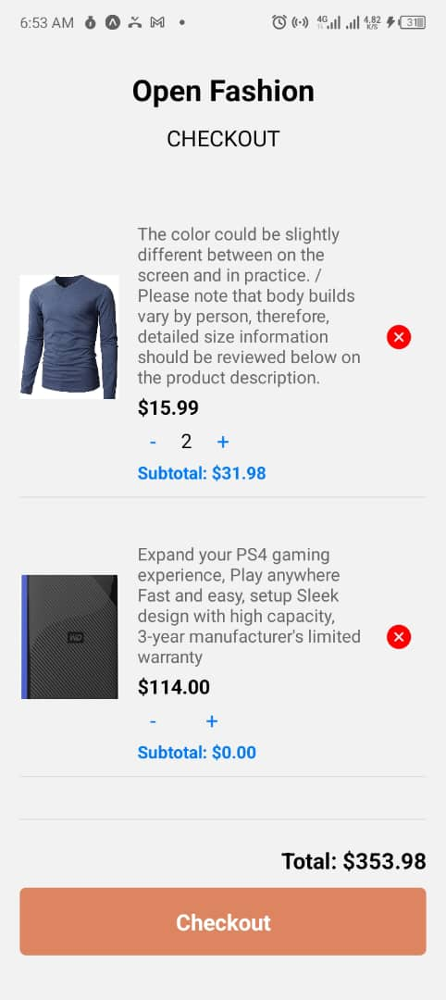
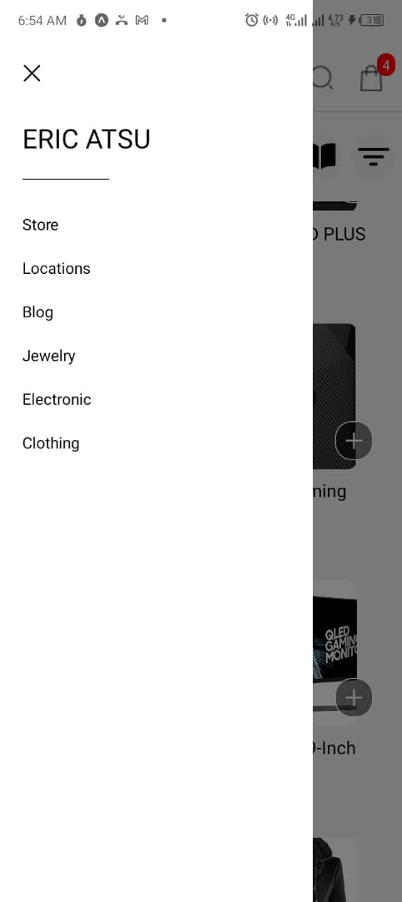

--ID 11294254--

# React Native App

This is a react application that basically demonstates the usage of the fetch/axios in react native. When the home screen is visited , all products are fetched from the fakestore api endpoint ```/products``` and displayed.A product can also be added to the cart where the total cost of your cart is also computed and displayed for checkout.

## How I went about it

I chose to use aysnc storage because it works perfectly for small sums of data like these. As usual, I set up the page navigation in the ```App.js``` . Initially the products are rendered on the homescreen. When an items is clicked at the add button. it updates the cartlist and renders the UI respectively.

<p>
  
  
  
</p>


## How to Run

1. **Install Dependencies**:
    ```bash
    npm install
    ```

2. **Start the App**:
    ```bash
    expo start
    ```

3. **Run on Emulator or Device**:
    - Press `a` to open on an Android emulator.
    - Press `i` to open on an iOS simulator.